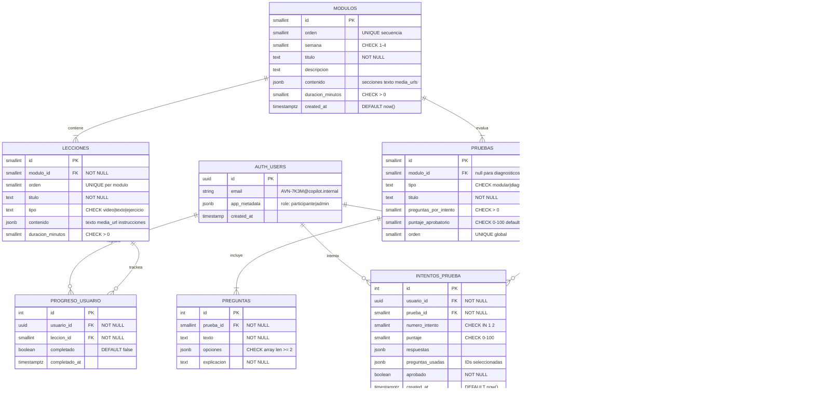

# feat: Plataforma LMS para Taller de Copilot Chat

## Enhancement Summary

**Profundizado el:** 2026-03-29
**Agentes de investigacion utilizados:** 7 (best-practices, framework-docs, security-sentinel, architecture-strategist, performance-oracle, data-integrity-guardian, code-simplicity-reviewer)

### Cambios Criticos vs Plan Original

1. **SEGURIDAD: Rol en `app_metadata` (no `user_metadata`)** — `user_metadata` es editable por el usuario, permitiria escalacion de privilegios
2. **SEGURIDAD: Codigos aleatorios** — Cambiar de `USR001` (predecible) a `AVN-7K3M` (aleatorio)
3. **SEGURIDAD: Tabla `preguntas` bloqueada** — SELECT directo denegado; solo accesible via funcion `security definer`
4. **ARQUITECTURA: AuthContext obligatorio** — React Context para sesion + progreso
5. **SIMPLIFICACION: 2 Edge Functions** (no 4) — `assign-challenge` pasa a PL/pgSQL, certificado se genera client-side
6. **SIMPLIFICACION: 7 tablas** (no 10) — Fusionar retos, eliminar tabla certificados
7. **PERFORMANCE: Supabase Pro tier obligatorio** ($25/mes) — Free tier se pausa y tiene limites de conexion
8. **PERFORMANCE: lite-youtube-embed** — Ahorra 3-5MB por pagina con videos
9. **PERFORMANCE: Indices criticos** + `(select auth.uid())` en RLS (94-99% mas rapido)
10. **REACT ROUTER v7: Instalar `react-router`** (no `react-router-dom`) — Data Mode con `createBrowserRouter`

---

## Overview

Construir una plataforma LMS dentro del repositorio existente de la landing de Avianca, accesible desde `/course/*`, donde 200 colaboradores de RR.HH. completen un taller asincronico de 4 semanas sobre Copilot Chat e IA. La landing actual (`/`) no se modifica.

**Stack:** React 19 + React Router v7 + Supabase (Auth, DB, Storage, Edge Functions) + Tailwind CSS v4 + Vercel.

## Problem Statement / Motivation

Avianca necesita capacitar a su equipo de RR.HH. (~200 personas, multiples paises hispanos, diversas edades) en el uso avanzado de Copilot Chat para reducir tiempos operativos. Actualmente solo existe una landing informativa con el programa y un link a Microsoft Forms. No hay plataforma de aprendizaje, evaluacion ni seguimiento.

## Proposed Solution

Arquitectura **Supabase-first**: el cliente React consume directamente la DB via `@supabase/supabase-js` para lecturas, y Edge Functions (Deno) manejan logica compleja (generacion de codigos, calificacion de pruebas). RLS enforcea seguridad a nivel de DB. Videos en YouTube no listado, imagenes en Supabase Storage. Deploy en Vercel con SPA rewrites.

(ver brainstorm: `docs/brainstorms/2026-03-29-lms-copilot-training-brainstorm.md`)

---

## Technical Approach

### Architecture

```
┌─────────────────────────────────────────────────────────┐
│                      Vercel (SPA)                       │
│  ┌─────────────┐  ┌──────────────────────────────────┐  │
│  │  Landing (/) │  │        LMS (/course/*)           │  │
│  │  App.jsx     │  │  React Router v7 (Data Mode)     │  │
│  │  (intacta)   │  │  ├── login                       │  │
│  │              │  │  ├── dashboard                    │  │
│  │              │  │  ├── modulo/:id                   │  │
│  │              │  │  ├── modulo/:id/prueba            │  │
│  │              │  │  ├── diagnostico/:tipo            │  │
│  │              │  │  ├── reto                         │  │
│  │              │  │  ├── certificado                  │  │
│  │              │  │  └── admin                        │  │
│  └─────────────┘  └──────────────────────────────────┘  │
└─────────────────────┬───────────────────────────────────┘
                      │ @supabase/supabase-js
                      ▼
┌─────────────────────────────────────────────────────────┐
│                  Supabase (Pro tier)                     │
│  ┌──────────┐  ┌──────────┐  ┌────────────────────────┐ │
│  │   Auth   │  │ Postgres │  │    Edge Functions       │ │
│  │ (codes)  │  │  + RLS   │  │ ├── generate-codes      │ │
│  │          │  │          │  │ └── submit-quiz          │ │
│  └──────────┘  │ PL/pgSQL │  └────────────────────────┘ │
│                │ ├── assign_challenge()                   │
│  ┌──────────┐  │ ├── get_quiz_questions()                │
│  │ Storage  │  │ └── check_certificate_ready()           │
│  │ (imgs)   │  └──────────┘                              │
│  └──────────┘                                            │
└─────────────────────────────────────────────────────────┘
```

### Dependencias a instalar

```bash
npm install react-router @supabase/supabase-js lite-youtube-embed
```

> **React Router v7:** Instalar solo `react-router`. El paquete `react-router-dom` ya no es separado en v7. Usar **Data Mode** con `createBrowserRouter` (no Framework Mode).

### Estructura de archivos

```
src/
├── main.jsx                    # createBrowserRouter + RouterProvider
├── App.jsx                     # Landing (SIN CAMBIOS)
├── App.css                     # Animaciones landing (SIN CAMBIOS)
├── index.css                   # @import "tailwindcss" + @theme (colores Avianca)
├── lib/
│   └── supabase.js             # Cliente Supabase (singleton)
├── context/
│   └── auth-context.jsx        # AuthProvider + useAuth hook
├── course/
│   ├── layout.jsx              # Layout LMS (nav, sidebar, detecta admin por rol)
│   ├── login.jsx               # Login (codigo + contraseña)
│   ├── dashboard.jsx           # Dashboard con progreso y modulos
│   ├── modulo.jsx              # Visor de modulo (lecciones inline)
│   ├── prueba.jsx              # Motor quiz MCQ (modular + diagnostico)
│   ├── reto.jsx                # Reto final (editor + entrega)
│   ├── certificado.jsx         # Genera PDF client-side con jsPDF
│   └── admin.jsx               # Dashboard admin (stats, progreso)
├── components/
│   ├── protected-route.jsx     # Guard de autenticacion (Outlet pattern)
│   ├── progress-bar.jsx        # Barra de progreso reutilizable
│   └── quiz-question.jsx       # Componente de pregunta MCQ
└── assets/
```

### ERD (Modelo de datos simplificado — 7 tablas)



**Cambios vs plan original:**
- `asignacion_retos` + `entregas_reto` fusionadas en una sola tabla `entregas_reto` (relacion 1:1)
- Tabla `certificados` eliminada (PDF se genera client-side bajo demanda)
- `user_metadata.role` → `app_metadata.role` (no editable por el usuario)
- Codigos aleatorios `AVN-XXXX` en vez de secuenciales `USR001`
- Tipos `SMALLINT` para valores acotados, `TIMESTAMPTZ` para timestamps

---

### Implementation Phases (4 fases consolidadas)

#### Phase 1: Fundacion + Autenticacion

**Objetivo:** Routing, Supabase, auth, rutas protegidas. Landing intacta.

**Tareas:**

- [ ] Instalar: `react-router`, `@supabase/supabase-js`, `lite-youtube-embed`
- [ ] Crear proyecto Supabase (Pro tier, $25/mes)
  - Deshabilitar "Confirm email" en Auth settings
  - Deshabilitar "Enable sign up" (solo `generate-codes` crea cuentas)
  - Deshabilitar password recovery
- [ ] Crear `.env.example` y `.env` con `VITE_SUPABASE_URL`, `VITE_SUPABASE_ANON_KEY`
- [ ] Agregar `.env` a `.gitignore`
- [ ] Crear `vercel.json`:
  ```json
  {"rewrites": [{"source": "/(.*)", "destination": "/index.html"}]}
  ```
- [ ] Mover colores Avianca a `@theme` en `src/index.css`:
  ```css
  @import "tailwindcss";
  @theme {
    --color-avianca-red: #FF0000;
    --color-avianca-magenta: #B50080;
    --color-avianca-cyan: #89D4E1;
    --color-avianca-dark: #1e293b;
  }
  ```
- [ ] Crear `src/lib/supabase.js`:
  ```js
  import { createClient } from '@supabase/supabase-js'
  export const supabase = createClient(
    import.meta.env.VITE_SUPABASE_URL,
    import.meta.env.VITE_SUPABASE_ANON_KEY
  )
  ```
- [ ] Crear `src/context/auth-context.jsx`:
  ```jsx
  // AuthProvider con onAuthStateChange + useAuth hook
  // Expone: { user, session, loading, signIn, signOut }
  // user.app_metadata.role para distinguir admin/participante
  ```
- [ ] Configurar router en `src/main.jsx`:
  ```jsx
  import { createBrowserRouter, RouterProvider } from 'react-router'
  // "/" → App.jsx (landing intacta)
  // "/course" → ProtectedRoute → CourseLayout → children
  // "/course/admin" → ProtectedRoute(adminOnly) → admin.jsx
  ```
- [ ] Crear `src/components/protected-route.jsx`:
  ```jsx
  // Verifica session via useAuth()
  // Si no autenticado → Navigate to /course/login
  // Prop adminOnly → verifica user.app_metadata.role === 'admin'
  // Renderiza <Outlet /> para rutas hijas
  ```
- [ ] Crear `src/course/login.jsx`:
  ```jsx
  // Input de codigo (ej: AVN-7K3M)
  // Input de contraseña
  // signInWithPassword({ email: `${code}@copilot.internal`, password })
  // Error generico: "Codigo o contraseña incorrectos" (sin diferenciar)
  ```
- [ ] Crear schema SQL completo: `supabase/migrations/001_schema.sql`
- [ ] Crear RLS policies: `supabase/migrations/002_rls_policies.sql`
- [ ] Crear indices: `supabase/migrations/003_indexes.sql`
- [ ] Crear funciones PL/pgSQL: `supabase/migrations/004_functions.sql`
- [ ] Crear triggers: `supabase/migrations/005_triggers.sql`
- [ ] Crear seed con datos de prueba: `supabase/seed.sql`
- [ ] Implementar Edge Function `generate-codes`:
  ```ts
  // Genera codigos aleatorios AVN-XXXX (4 chars alfanumericos)
  // supabaseAdmin.auth.admin.createUser({
  //   email: `${code}@copilot.internal`,
  //   password: generatedPassword,
  //   email_confirm: true,
  //   app_metadata: { role: 'participante', code }
  // })
  // Retorna CSV/JSON con codigos + contraseñas
  // Solo ejecutable verificando que el caller es admin
  ```

**Archivos clave:**

```
src/main.jsx (modificado)
src/index.css (modificado — @theme)
src/lib/supabase.js
src/context/auth-context.jsx
src/components/protected-route.jsx
src/course/layout.jsx (placeholder)
src/course/login.jsx
.env.example
vercel.json
supabase/migrations/001_schema.sql
supabase/migrations/002_rls_policies.sql
supabase/migrations/003_indexes.sql
supabase/migrations/004_functions.sql
supabase/migrations/005_triggers.sql
supabase/seed.sql
supabase/functions/generate-codes/index.ts
```

**Criterio de exito:**
- Landing en `/` funciona identica
- Login funcional con codigo + contraseña
- Rutas `/course/*` protegidas, redirigen a login
- Supabase conecta, tablas existen, RLS activo

---

#### Phase 2: Dashboard + Visor de Contenido

**Objetivo:** Dashboard con progreso, visor de modulos/lecciones, tracking de completado.

**Tareas:**

- [ ] Implementar `src/course/layout.jsx`:
  - Header: logo Avianca, codigo del usuario, logout
  - Navegacion lateral con modulos y estado (bloqueado/disponible/completado)
  - Responsive mobile-first
  - Si `user.app_metadata.role === 'admin'` → mostrar link a admin
- [ ] Implementar `src/course/dashboard.jsx`:
  - Barra de progreso general (% del taller)
  - Si diagnostico pre no completado → CTA prominente
  - Grid de modulos con estado visual:
    - Bloqueado (candado) — tooltip "Completa el modulo anterior"
    - Disponible (activo) — click navega al modulo
    - Completado (check) — click permite repaso
  - Puntaje acumulado (promedio mejores puntajes)
  - Comparacion diagnostico pre vs post (cuando ambos completados)
  - Si todo completado → CTA certificado
- [ ] Implementar `src/course/modulo.jsx`:
  - Carga modulo + lecciones desde Supabase
  - Lista de lecciones con estado
  - Renderiza leccion segun `tipo`:
    - `video`: `<lite-youtube videoid="...">` (facade, carga iframe solo al click)
    - `texto`: contenido enriquecido con imagenes
    - `ejercicio`: instrucciones + boton "Marcar como completado"
  - Boton confirmacion → INSERT `progreso_usuario`
  - Navegacion entre lecciones (anterior/siguiente)
  - Boton "Ir a la prueba" cuando todas las lecciones completadas
  - Permite volver a ver lecciones completadas (solo lectura)
- [ ] Implementar `src/components/progress-bar.jsx`

**Logica de desbloqueo (secuencial estricto):**
```
1. Diagnostico Pre → siempre disponible si no completado
2. Modulo 1 → disponible si diagnostico pre COMPLETADO (no aprobado — es diagnostico)
3. Modulo 2 → disponible si modulo 1 completado (lecciones + prueba aprobada)
4. ... (cada modulo requiere el anterior)
5. Diagnostico Post → disponible si modulo 6 completado
6. Reto → disponible si diagnostico post completado
7. Certificado → disponible si reto entregado (estado = 'enviado')
```

> **Nota:** Los diagnosticos desbloquean al COMPLETARSE, no al aprobarse. Son evaluaciones de nivel, no filtros.

**Criterio de exito:**
- Dashboard muestra estado correcto de cada modulo
- Videos cargan via lite-youtube-embed (facade, no iframe directo)
- Progreso se persiste en Supabase
- Navegacion responsive funcional en mobile

---

#### Phase 3: Evaluaciones + Reto Final

**Objetivo:** Quizzes MCQ con calificacion server-side, diagnosticos, reto con asignacion aleatoria.

**Tareas:**

- [ ] Crear funcion PL/pgSQL `get_quiz_questions(p_prueba_id, p_usuario_id)`:
  ```sql
  -- SECURITY DEFINER: accede a preguntas sin exponer es_correcta
  -- Selecciona N preguntas aleatorias del banco
  -- Excluye preguntas usadas en intentos previos de este usuario
  -- Retorna: id, texto, opciones (SIN es_correcta)
  -- NUNCA exponer la tabla preguntas al cliente directamente
  ```
- [ ] Implementar Edge Function `submit-quiz`:
  ```ts
  // Recibe: prueba_id, respuestas [{pregunta_id, opcion_seleccionada}]
  // Valida server-side:
  //   - JWT valido (getClaims, no getUser)
  //   - numero_intento <= 2
  //   - Prerequisitos cumplidos (modulo anterior completado)
  //   - Preguntas pertenecen a esta prueba
  // Califica: compara con es_correcta en la DB
  // Guarda intentos_prueba
  // Retorna: puntaje, aprobado, detalle por pregunta + explicacion
  // CORS: solo dominio de Vercel (no wildcard *)
  ```
- [ ] RLS: bloquear SELECT en tabla `preguntas` para rol `authenticated`:
  ```sql
  -- NO crear policy de SELECT → nadie lee directo
  -- Solo accesible via get_quiz_questions() (security definer)
  ALTER TABLE preguntas ENABLE ROW LEVEL SECURITY;
  -- Sin policy = bloqueado por defecto con RLS habilitado
  ```
- [ ] Implementar `src/course/prueba.jsx`:
  - Carga preguntas via `supabase.rpc('get_quiz_questions', {p_prueba_id, p_usuario_id})`
  - Renderiza preguntas MCQ
  - Botones de navegacion (anterior/siguiente pregunta)
  - Submit → llama Edge Function `submit-quiz`
  - Muestra resultado:
    - Aprobado: "Siguiente modulo" + detalle con explicaciones
    - Reprobado intento 1: "Reintentar" + feedback por pregunta
    - Reprobado intento 2: "Contacta al administrador" + feedback
  - Diagnosticos: mismo componente, distingue por `tipo` en ruta
    - No bloquea por puntaje, solo registra resultado
    - Solo 1 intento por diagnostico
  - Accesible: navegacion por teclado en radio buttons, contraste adecuado
- [ ] Crear funcion PL/pgSQL `assign_challenge(p_usuario_id)`:
  ```sql
  -- Selecciona reto aleatorio del pool
  -- INSERT en entregas_reto con estado 'borrador'
  -- Idempotente: si ya existe entrega, retorna la existente
  -- No necesita Edge Function (no hay logica compleja)
  ```
- [ ] Implementar `src/course/reto.jsx`:
  - Carga asignacion via `supabase.rpc('assign_challenge', {p_usuario_id})`
  - Muestra escenario + criterios de evaluacion
  - Textarea para respuesta
  - Proteccion contra perdida: `beforeunload` event + `localStorage`
  - Boton "Enviar entrega final":
    - Modal de confirmacion ("Esta accion es definitiva")
    - UPDATE `estado: 'enviado'`, `submitted_at: now()`
  - Post-envio: solo lectura
- [ ] Implementar `src/components/quiz-question.jsx`

**Criterio de exito:**
- Respuestas correctas NUNCA visibles en Network tab
- 2 intentos con preguntas diferentes por intento
- 80% para aprobar pruebas modulares
- Diagnosticos registran sin bloquear
- Reto asignado aleatoriamente, entrega con confirmacion

---

#### Phase 4: Certificado + Admin

**Objetivo:** Certificado PDF client-side, panel admin basico.

**Tareas:**

- [ ] Instalar `jspdf` (lazy-loaded):
  ```bash
  npm install jspdf
  ```
- [ ] Crear funcion PL/pgSQL `check_certificate_ready(p_usuario_id)`:
  ```sql
  -- Verifica: todas pruebas modulares aprobadas
  --           diagnosticos pre y post completados
  --           reto entregado (estado = 'enviado')
  -- Retorna: { ready: boolean, missing: string[], scores: {...} }
  ```
- [ ] Implementar `src/course/certificado.jsx`:
  - Llama `supabase.rpc('check_certificate_ready', {p_usuario_id})`
  - Si no listo: muestra que falta por completar
  - Si listo: genera PDF client-side con `jsPDF` (lazy import):
    ```jsx
    const generatePDF = async () => {
      const { jsPDF } = await import('jspdf')
      const doc = new jsPDF()
      // Logo Avianca (base64 comprimido < 100KB)
      // Titulo, codigo participante, puntaje, fecha, mejora diagnostica
      doc.save('certificado-copilot.pdf')
    }
    ```
  - No necesita Edge Function ni Storage ni signed URLs
  - La validacion de prerequisitos es server-side (funcion PL/pgSQL)
- [ ] Implementar `src/course/admin.jsx`:
  - Solo visible para `app_metadata.role === 'admin'`
  - Metricas generales: registrados, activos, completados, promedio progreso
  - Tabla de usuarios: codigo | progreso % | modulo actual | puntaje
  - Usuarios bloqueados (fallaron 2 intentos) — destacados
  - Comparacion diagnostica: promedio pre vs post
  - Queries directas a Supabase con RLS admin
- [ ] RLS admin: policies que permiten SELECT en todas las filas cuando `role = 'admin'`:
  ```sql
  CREATE POLICY "admin_read_all" ON intentos_prueba
  FOR SELECT USING (
    (select auth.uid()) = usuario_id
    OR (select (auth.jwt()->'app_metadata'->>'role')) = 'admin'
  );
  ```

**Criterio de exito:**
- PDF se genera con datos correctos, descarga inmediata
- Admin ve progreso de todos los participantes
- Usuarios bloqueados identificables rapidamente

---

## Security Hardening

### Vulnerabilidades resueltas

| # | Vulnerabilidad | Severidad | Mitigacion |
|---|---|---|---|
| 1 | **Escalacion de privilegios via `user_metadata`** | CRITICA | Usar `app_metadata.role` (solo editable server-side) |
| 2 | **`es_correcta` visible en DevTools** | ALTA | Tabla `preguntas` sin SELECT policy. Solo via `security definer` function |
| 3 | **Codigos predecibles (USR001)** | ALTA | Codigos aleatorios `AVN-XXXX` (4 chars alfanumericos, excluir 0/O, 1/l/I) |
| 4 | **Bypass progresion via API directa** | ALTA | Validacion en `submit-quiz` Edge Function (prerequisitos) |
| 5 | **signUp publico habilitado** | MEDIA | Deshabilitar en Supabase Auth settings |
| 6 | **Recovery de password sin email real** | MEDIA | Deshabilitar en Supabase Auth settings |
| 7 | **CORS permisivo** | MEDIA | Restringir a dominio Vercel (no `*`) |
| 8 | **Error de login revela existencia de codigo** | MEDIA | Mensaje generico: "Codigo o contraseña incorrectos" |

### Checklist post-deploy

```sql
-- Verificar RLS habilitado en TODAS las tablas
SELECT tablename, rowsecurity FROM pg_tables WHERE schemaname = 'public';
-- Todas deben tener rowsecurity = true
```

---

## Data Integrity

### Constraints criticos (en `001_schema.sql`)

```sql
-- MODULOS
ALTER TABLE modulos
  ADD CONSTRAINT modulos_orden_unique UNIQUE (orden),
  ADD CONSTRAINT modulos_semana_check CHECK (semana BETWEEN 1 AND 4),
  ADD CONSTRAINT modulos_duracion_check CHECK (duracion_minutos > 0);

-- LECCIONES
ALTER TABLE lecciones
  ADD CONSTRAINT lecciones_orden_unique_per_modulo UNIQUE (modulo_id, orden),
  ADD CONSTRAINT lecciones_tipo_check CHECK (tipo IN ('video', 'texto', 'ejercicio'));

-- PRUEBAS
ALTER TABLE pruebas
  ADD CONSTRAINT pruebas_tipo_check CHECK (tipo IN ('modular', 'diagnostico_pre', 'diagnostico_post')),
  ADD CONSTRAINT pruebas_puntaje_check CHECK (puntaje_aprobatorio BETWEEN 0 AND 100),
  ADD CONSTRAINT pruebas_orden_unique UNIQUE (orden),
  ADD CONSTRAINT pruebas_modulo_coherencia CHECK (
    (tipo = 'modular' AND modulo_id IS NOT NULL)
    OR (tipo IN ('diagnostico_pre', 'diagnostico_post') AND modulo_id IS NULL)
  );

-- PREGUNTAS
ALTER TABLE preguntas
  ADD CONSTRAINT preguntas_opciones_check CHECK (
    jsonb_typeof(opciones) = 'array' AND jsonb_array_length(opciones) >= 2
  );

-- PROGRESO
ALTER TABLE progreso_usuario
  ADD CONSTRAINT progreso_unique UNIQUE (usuario_id, leccion_id),
  ADD CONSTRAINT progreso_coherencia CHECK (
    (completado = true AND completado_at IS NOT NULL)
    OR (completado = false AND completado_at IS NULL)
  );

-- INTENTOS (maximo 2 por usuario+prueba, enforceado en DB)
ALTER TABLE intentos_prueba
  ADD CONSTRAINT intentos_unique UNIQUE (usuario_id, prueba_id, numero_intento),
  ADD CONSTRAINT intentos_numero_check CHECK (numero_intento IN (1, 2)),
  ADD CONSTRAINT intentos_puntaje_check CHECK (puntaje BETWEEN 0 AND 100);

-- ENTREGAS
ALTER TABLE entregas_reto
  ADD CONSTRAINT entregas_usuario_unique UNIQUE (usuario_id),
  ADD CONSTRAINT entregas_estado_check CHECK (estado IN ('borrador', 'enviado'));
```

### Triggers (en `005_triggers.sql`)

```sql
-- 1. Prevenir reversion de estado enviado → borrador
CREATE TRIGGER trg_entrega_state_guard
  BEFORE UPDATE ON entregas_reto
  FOR EACH ROW EXECUTE FUNCTION prevent_entrega_state_regression();

-- 2. Validar que intento 2 tiene intento 1
CREATE TRIGGER trg_intento_secuencial
  BEFORE INSERT ON intentos_prueba
  FOR EACH ROW EXECUTE FUNCTION validate_intento_secuencial();

-- 3. Validar coherencia aprobado/puntaje vs umbral
CREATE TRIGGER trg_aprobado_coherencia
  BEFORE INSERT ON intentos_prueba
  FOR EACH ROW EXECUTE FUNCTION validate_aprobado_coherencia();
```

### Indices (en `003_indexes.sql`)

```sql
-- Queries frecuentes por usuario
CREATE INDEX idx_progreso_usuario ON progreso_usuario(usuario_id);
CREATE INDEX idx_intentos_usuario_prueba ON intentos_prueba(usuario_id, prueba_id);
CREATE INDEX idx_entregas_usuario ON entregas_reto(usuario_id);

-- Navegacion de contenido
CREATE INDEX idx_lecciones_modulo ON lecciones(modulo_id, orden);
CREATE INDEX idx_pruebas_modulo ON pruebas(modulo_id);
CREATE INDEX idx_preguntas_prueba ON preguntas(prueba_id);
```

### RLS Performance

```sql
-- SIEMPRE usar (select auth.uid()) en vez de auth.uid() directamente
-- Esto activa initPlan de Postgres: cachea el valor por statement (94-99% mas rapido)
CREATE POLICY "users_own_progress" ON progreso_usuario
  FOR SELECT USING ((select auth.uid()) = usuario_id);
```

---

## Performance Considerations

| Area | Riesgo | Mitigacion |
|---|---|---|
| Conexiones Supabase | Free tier insuficiente (60 conexiones) | **Pro tier obligatorio** ($25/mes, 200 conexiones) |
| Edge Function cold starts | 200-500ms en primera invocacion | Con 200 usuarios activos, se mantienen warm. UI optimistic. |
| RLS subqueries | Policies complejas = 20-100ms overhead | Validar progresion solo en `submit-quiz`, RLS basico en lectura |
| YouTube embeds | 500KB-1MB por iframe, 3-5MB con multiples | **lite-youtube-embed**: facade que carga iframe solo al click |
| Bundle size | ~95KB sin jsPDF | **Code splitting** con `React.lazy()` por ruta. jsPDF lazy-loaded. |
| Quiz question selection | `ORDER BY RANDOM()` + exclusion | **NOT EXISTS** en vez de NOT IN. Indices en `(usuario_id, pregunta_id)`. |
| Dashboard admin | JOINs agregados sobre 200 usuarios | Indices compuestos + paginacion (20-50 por pagina). Trivial a esta escala. |

### Code Splitting (en `main.jsx`)

```jsx
import { lazy } from 'react'
const Dashboard = lazy(() => import('./course/dashboard'))
const Modulo = lazy(() => import('./course/modulo'))
const Prueba = lazy(() => import('./course/prueba'))
const Reto = lazy(() => import('./course/reto'))
const Certificado = lazy(() => import('./course/certificado'))
const Admin = lazy(() => import('./course/admin'))
```

---

## System-Wide Impact

### Interaction Graph

```
Login → supabase.auth.signInWithPassword()
  → AuthContext actualiza session
  → RLS usa auth.uid() en cada query

Completar leccion → INSERT progreso_usuario (RLS: own data)
  → dashboard re-calcula estado de modulos

Submit prueba → Edge Function submit-quiz
  → valida JWT (getClaims) + prerequisitos
  → califica server-side (lee es_correcta de DB)
  → INSERT intentos_prueba
  → retorna puntaje + detalle al cliente

Completar diagnostico post → cliente llama supabase.rpc('assign_challenge')
  → PL/pgSQL asigna reto aleatorio (idempotente)
  → INSERT entregas_reto con estado 'borrador'

Entregar reto → UPDATE entregas_reto estado='enviado'
  → trigger previene reversion
  → habilita certificado en dashboard

Generar certificado → supabase.rpc('check_certificate_ready')
  → si ready: jsPDF genera PDF client-side
  → descarga directa (sin Storage)
```

### Error Handling

```jsx
// Contrato de errores para Edge Functions:
// { error: string, code: string }

// ErrorBoundary generico en layout del LMS
// Toast notifications para confirmaciones y errores
// Spinner/skeleton en estados de carga
```

---

## Acceptance Criteria

### Functional

- [ ] Landing en `/` funciona identica (sin cambios)
- [ ] Login con codigo + contraseña funcional
- [ ] Progresion secuencial estricta (UI + server-side en submit-quiz)
- [ ] 6 modulos con lecciones (video via lite-youtube, texto, ejercicio)
- [ ] Pruebas MCQ: banco de preguntas, 2 intentos, preguntas diferentes, 80%
- [ ] Diagnosticos pre/post con preguntas distintas (sin umbral)
- [ ] Reto final asignado aleatoriamente, entrega con confirmacion
- [ ] Certificado PDF generado client-side al completar todo
- [ ] Panel admin: progreso, puntajes, usuarios bloqueados
- [ ] Respuestas correctas NUNCA visibles en frontend

### Non-Functional

- [ ] Soporta 200 usuarios concurrentes (Supabase Pro)
- [ ] Responsive mobile/tablet/desktop
- [ ] Accesible: teclado en quizzes, contraste para usuarios mayores
- [ ] Bundle inicial < 80KB gzipped (con code splitting)
- [ ] Videos cargan via facade (lite-youtube), no iframe directo

---

## Dependencies

| Dependencia | Estado | Accion |
|---|---|---|
| Proyecto Supabase (Pro) | Pendiente | Crear en supabase.com ($25/mes) |
| Videos YouTube no listado | Pendiente | Equipo produce y sube |
| Contenido textual | Pendiente | IA genera (NotebookLM CLI) + revision humana |
| Dominio Vercel | Pendiente | Configurar deploy |

## Risk Analysis

| Riesgo | Prob. | Impacto | Mitigacion |
|---|---|---|---|
| Usuarios bloqueados (fallo 2 intentos) | Alta | Alto | Admin resetea via SQL: `DELETE FROM intentos_prueba WHERE usuario_id = X AND prueba_id = Y` |
| Olvido de contraseña | Media | Medio | Admin resetea via Supabase dashboard |
| Video YouTube eliminado | Baja | Alto | Backup de URLs, monitoring |
| jsPDF no renderiza bien en mobile | Media | Medio | Probar temprano, diseño simple |
| Contenido no listo a tiempo | Media | Alto | Plataforma con seeds de prueba, contenido se carga al final |

---

## Resolved Questions

| Pregunta | Decision | Fuente |
|---|---|---|
| user_metadata vs app_metadata para rol | `app_metadata` (no editable por usuario) | Security audit |
| Codigos secuenciales vs aleatorios | Aleatorios AVN-XXXX | Security audit |
| 4 Edge Functions vs menos | 2 (generate-codes + submit-quiz) | Simplicity review |
| Certificado server-side vs client-side | Client-side con jsPDF (validacion server-side via RPC) | Simplicity + Architecture |
| Admin dashboard custom vs Supabase SQL | Dashboard basico en la app | User requirement |
| Diagnostico "aprobado" vs "completado" | Desbloquea al COMPLETARSE (no tiene umbral) | Architecture review |
| RLS subqueries para progresion | RLS basico + validacion en submit-quiz | Performance + Simplicity |
| Autoguardado multi-capa | localStorage + beforeunload (simple) | Simplicity review |
| react-router-dom vs react-router | `react-router` (v7 unifica todo) | Framework docs |

---

## Sources & References

### Origin

- **Brainstorm:** [docs/brainstorms/2026-03-29-lms-copilot-training-brainstorm.md](docs/brainstorms/2026-03-29-lms-copilot-training-brainstorm.md)

### External References

- [Supabase Auth Admin API](https://supabase.com/docs/reference/javascript/auth-admin-createuser)
- [Supabase RLS Best Practices](https://supabase.com/docs/guides/database/postgres/row-level-security)
- [Supabase RLS Performance (initPlan)](https://supabase.com/docs/guides/database/database-advisors?queryGroups=lint&lint=0003_auth_rls_initplan)
- [Supabase Edge Functions](https://supabase.com/docs/guides/functions)
- [Supabase Edge Functions Auth (getClaims)](https://supabase.com/docs/guides/functions/auth)
- [React Router v7 Data Mode](https://reactrouter.com/start/data/custom)
- [Tailwind CSS v4 @theme](https://tailwindcss.com/docs/functions-and-directives)
- [lite-youtube-embed](https://github.com/nicedoc/lite-youtube-embed)
- [jsPDF](https://github.com/parallax/jsPDF)
