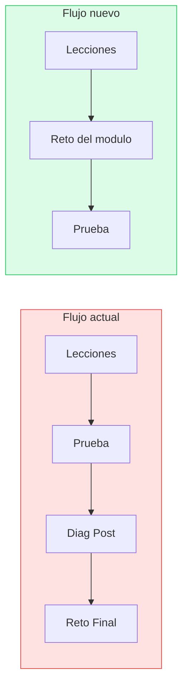
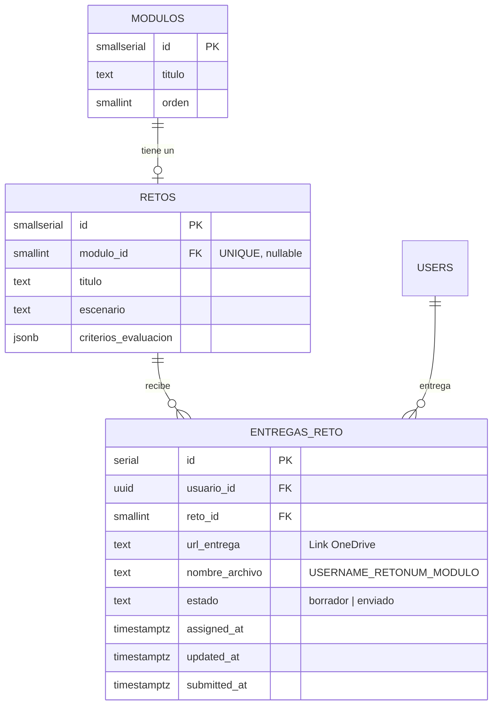

# Retos por modulo con entrega de link OneDrive

## Enhancement Summary

**Deepened on:** 2026-04-04
**Sections enhanced:** 6 (migracion, frontend modulo, dashboard, admin, certificado, edge cases)

### Key Improvements
1. Migracion corregida: constraint names exactos, RLS `users_read_assigned_reto` actualizada, admin policies preservadas
2. `check_certificate_ready` RPC actualizada para verificar retos por modulo (no global)
3. Reutilizar `ConfirmModal` existente en vez de crear modal inline nuevo
4. Progress tracking en admin recalculado: `totalSteps` incluye retos por modulo

### Gaps Descubiertos
- La prueba no tiene validacion server-side de prerequisitos (solo UI gating)
- `check_certificate_ready` necesita reescritura completa para retos por modulo
- `admin.jsx` calcula `totalSteps = pruebasModulares.length + 3` — debe incluir retos

---

## Overview

Transformar el sistema de retos de un "reto final unico" a **un reto por modulo**. Cada reto pide al usuario crear algo con IA externamente y pegar el link de OneDrive. El reto es obligatorio antes de la prueba para completar el modulo al 100%.

## Flujo actual vs nuevo



## Cambios en el flujo por modulo

```
Lecciones (1..N) → Reto del modulo → Prueba modular
                    ↑                  ↑
                    Obligatorio        Solo accesible si reto enviado
```

- Completar todas las lecciones desbloquea el reto
- Enviar el reto desbloquea la prueba
- Modulo 100% = lecciones + reto + prueba

## Convención de nombre de archivo

El usuario debe nombrar su archivo en OneDrive siguiendo:

```
{USERCODE}_{RETO#}_{MODULO}
```

Ejemplo: `AVN-1234_RETO1_NuevosHorizontes`

Esto se muestra como instrucción en la UI del reto. La plataforma no renombra archivos (están en OneDrive externo).

---

## Migración Supabase

### `supabase/migrations/011_retos_por_modulo.sql`

```sql
-- ============================================================
-- Migrar retos de global a por modulo
-- ============================================================

-- 1. Agregar modulo_id a retos (cada modulo tiene su propio reto)
ALTER TABLE retos ADD COLUMN modulo_id SMALLINT REFERENCES modulos(id) ON DELETE CASCADE;
CREATE UNIQUE INDEX retos_modulo_id_unique ON retos(modulo_id) WHERE modulo_id IS NOT NULL;

-- 2. Cambiar entregas_reto: permitir multiples entregas por usuario (una por reto)
--    Constraint actual: entregas_reto_usuario_id_key (UNIQUE usuario_id)
ALTER TABLE entregas_reto DROP CONSTRAINT entregas_reto_usuario_id_key;
ALTER TABLE entregas_reto ADD CONSTRAINT entregas_reto_usuario_reto_unique UNIQUE (usuario_id, reto_id);

-- 3. Agregar campo url_entrega para el link de OneDrive
ALTER TABLE entregas_reto ADD COLUMN url_entrega TEXT;

-- 4. Agregar campo nombre_archivo para el nombre convencional
ALTER TABLE entregas_reto ADD COLUMN nombre_archivo TEXT;

-- 5. Eliminar constraint de coherencia (ya no aplica puntaje/retroalimentacion)
ALTER TABLE entregas_reto DROP CONSTRAINT IF EXISTS entregas_calificacion_coherencia;

-- 6. Eliminar columnas que ya no aplican
ALTER TABLE entregas_reto DROP COLUMN IF EXISTS contenido;
ALTER TABLE entregas_reto DROP COLUMN IF EXISTS puntaje;
ALTER TABLE entregas_reto DROP COLUMN IF EXISTS retroalimentacion;

-- 7. Limpiar entregas huerfanas (datos de prueba previos)
DELETE FROM entregas_reto WHERE reto_id NOT IN (SELECT id FROM retos);

-- ============================================================
-- Actualizar RLS policies
-- ============================================================

-- 8. Retos: actualizar policy de lectura (ya no requiere asignacion previa)
--    Antes: solo leia retos asignados via entregas_reto
--    Ahora: lee retos de modulos (acceso via modulo, no via asignacion)
DROP POLICY IF EXISTS "users_read_assigned_reto" ON retos;
CREATE POLICY "users_read_retos" ON retos
  FOR SELECT TO authenticated USING (true);

-- 9. Entregas: permitir INSERT directo (ya no via RPC)
CREATE POLICY "users_insert_own_entrega" ON entregas_reto
  FOR INSERT WITH CHECK (usuario_id = (select auth.uid()));

-- 10. Entregas: actualizar policy de lectura
DROP POLICY IF EXISTS "users_read_own_entrega" ON entregas_reto;
CREATE POLICY "users_read_own_entrega" ON entregas_reto
  FOR SELECT USING (usuario_id = (select auth.uid()));

-- 11. Entregas: actualizar policy de UPDATE (solo borradores)
DROP POLICY IF EXISTS "users_update_own_entrega" ON entregas_reto;
CREATE POLICY "users_update_own_entrega" ON entregas_reto
  FOR UPDATE USING (
    usuario_id = (select auth.uid())
    AND estado = 'borrador'
  );

-- Nota: admin policies existentes se preservan:
--   admin_read_all_retos, admin_write_retos, admin_read_all_entregas,
--   admin_delete_entregas_reto (usado por resetUser)

-- ============================================================
-- Eliminar RPC obsoleta
-- ============================================================

-- 12. assign_challenge ya no se necesita (asignacion era aleatoria)
DROP FUNCTION IF EXISTS assign_challenge(UUID);

-- ============================================================
-- Actualizar check_certificate_ready para retos por modulo
-- ============================================================

-- 13. Reescribir: verificar que TODOS los retos de modulos esten enviados
CREATE OR REPLACE FUNCTION check_certificate_ready(p_usuario_id UUID)
RETURNS JSONB
LANGUAGE plpgsql
SECURITY DEFINER
SET search_path = ''
AS $$
DECLARE
  v_result JSONB;
  v_missing TEXT[] := '{}';
  v_total_pruebas_modulares SMALLINT;
  v_aprobadas SMALLINT;
  v_diag_pre_done BOOLEAN;
  v_diag_post_done BOOLEAN;
  v_total_retos SMALLINT;
  v_retos_enviados SMALLINT;
  v_scores JSONB;
BEGIN
  -- Pruebas modulares aprobadas
  SELECT COUNT(*) INTO v_total_pruebas_modulares
  FROM public.pruebas WHERE tipo = 'modular';

  SELECT COUNT(DISTINCT ip.prueba_id) INTO v_aprobadas
  FROM public.intentos_prueba ip
  JOIN public.pruebas p ON ip.prueba_id = p.id
  WHERE ip.usuario_id = p_usuario_id
  AND ip.aprobado = true
  AND p.tipo = 'modular';

  IF v_aprobadas < v_total_pruebas_modulares THEN
    v_missing := array_append(v_missing,
      format('Pruebas modulares: %s de %s aprobadas', v_aprobadas, v_total_pruebas_modulares));
  END IF;

  -- Diagnostico pre
  SELECT EXISTS(
    SELECT 1 FROM public.intentos_prueba ip
    JOIN public.pruebas p ON ip.prueba_id = p.id
    WHERE ip.usuario_id = p_usuario_id AND p.tipo = 'diagnostico_pre'
  ) INTO v_diag_pre_done;
  IF NOT v_diag_pre_done THEN
    v_missing := array_append(v_missing, 'Diagnostico de entrada no completado');
  END IF;

  -- Diagnostico post
  SELECT EXISTS(
    SELECT 1 FROM public.intentos_prueba ip
    JOIN public.pruebas p ON ip.prueba_id = p.id
    WHERE ip.usuario_id = p_usuario_id AND p.tipo = 'diagnostico_post'
  ) INTO v_diag_post_done;
  IF NOT v_diag_post_done THEN
    v_missing := array_append(v_missing, 'Diagnostico de salida no completado');
  END IF;

  -- Retos por modulo: todos los retos vinculados a modulos deben estar enviados
  SELECT COUNT(*) INTO v_total_retos
  FROM public.retos WHERE modulo_id IS NOT NULL;

  SELECT COUNT(*) INTO v_retos_enviados
  FROM public.entregas_reto er
  JOIN public.retos r ON er.reto_id = r.id
  WHERE er.usuario_id = p_usuario_id
  AND er.estado = 'enviado'
  AND r.modulo_id IS NOT NULL;

  IF v_retos_enviados < v_total_retos THEN
    v_missing := array_append(v_missing,
      format('Retos: %s de %s enviados', v_retos_enviados, v_total_retos));
  END IF;

  -- Calcular puntajes
  SELECT jsonb_build_object(
    'promedio_modular', COALESCE((
      SELECT ROUND(AVG(best.max_puntaje))
      FROM (
        SELECT MAX(ip.puntaje) as max_puntaje
        FROM public.intentos_prueba ip
        JOIN public.pruebas p ON ip.prueba_id = p.id
        WHERE ip.usuario_id = p_usuario_id AND p.tipo = 'modular'
        GROUP BY ip.prueba_id
      ) best
    ), 0),
    'diagnostico_pre', COALESCE((
      SELECT ip.puntaje FROM public.intentos_prueba ip
      JOIN public.pruebas p ON ip.prueba_id = p.id
      WHERE ip.usuario_id = p_usuario_id AND p.tipo = 'diagnostico_pre'
      LIMIT 1
    ), 0),
    'diagnostico_post', COALESCE((
      SELECT ip.puntaje FROM public.intentos_prueba ip
      JOIN public.pruebas p ON ip.prueba_id = p.id
      WHERE ip.usuario_id = p_usuario_id AND p.tipo = 'diagnostico_post'
      LIMIT 1
    ), 0)
  ) INTO v_scores;

  RETURN jsonb_build_object(
    'ready', array_length(v_missing, 1) IS NULL,
    'missing', to_jsonb(v_missing),
    'scores', v_scores
  );
END;
$$;
```

### ERD nuevo



---

## Cambios en frontend

### 1. `src/course/modulo.jsx` — Agregar paso de reto

El modulo actualmente muestra: sidebar de lecciones + botón "Ir a la prueba".

**Estado actual relevante:**
- `allComplete` (linea 73): `lecciones.every(l => progresoMap[l.id])`
- Boton "Ir a la prueba" (linea 135): solo renderiza si `allComplete`
- La prueba NO valida server-side que las lecciones esten completas

**Cambios:**
- Cargar el reto del modulo y la entrega del usuario en `loadModulo`
- Agregar el reto como "paso" despues de la ultima leccion
- En sidebar: mostrar el reto como item extra con icono Trophy
- Condicion para prueba: `allComplete && retoEnviado`
- Reusar `ConfirmModal` de `src/components/confirm-modal.jsx` para confirmacion de envio

**Datos a cargar adicionales en `loadModulo`:**
```javascript
// Junto con modulo y lecciones
const [retoRes, entregaRes] = await Promise.all([
  supabase.from('retos').select('*').eq('modulo_id', id).maybeSingle(),
  supabase.from('entregas_reto')
    .select('*')
    .eq('usuario_id', user.id)
    // el reto_id se filtra despues de obtener el reto
])
```

**UI del reto inline:**
```
┌─────────────────────────────────────┐
│ Reto: [titulo]                      │
│                                     │
│ [escenario del reto]                │
│                                     │
│ Criterios:                          │
│ - criterio 1                        │
│ - criterio 2                        │
│                                     │
│ Nombra tu archivo como:             │
│ ┌─────────────────────────────────┐ │
│ │ AVN-1234_RETO1_NuevosHorizontes│ │  (copyable, generado dinamico)
│ └─────────────────────────────────┘ │
│                                     │
│ Link de OneDrive:                   │
│ ┌─────────────────────────────────┐ │
│ │ https://...                     │ │
│ └─────────────────────────────────┘ │
│                                     │
│          [Enviar reto]              │
│                                     │
│ --- si ya enviado ---               │
│ ✅ Reto enviado                     │
│ Link: https://...                   │
│          [Ir a la prueba →]         │
└─────────────────────────────────────┘
```

**Sidebar con reto:**
```
Leccion 1  ✅
Leccion 2  ✅
Leccion 3  ✅
🏆 Reto     ✅ (o ○ si pendiente)
──────────────
[Ir a la prueba →]  (solo si reto enviado)
```

### Edge cases modulo.jsx

- **Modulo sin reto:** Si no hay reto configurado para el modulo, el flujo es el actual (lecciones → prueba)
- **URL invalida:** Validar basico que el input empiece con `https://`
- **Doble submit:** Deshabilitar boton durante saving, usar `ConfirmModal`
- **Nombre de archivo:** Generar dinamicamente con `userCode` del contexto de auth

### 2. `src/course/dashboard.jsx` — Actualizar completitud

**`getModuleStatus` (linea 79):** Agregar chequeo de reto.

```javascript
// Necesita acceso a: retos (con modulo_id) y entregas del usuario
const moduleReto = retos.find(r => r.modulo_id === modulo.id)
const retoEnviado = moduleReto
  ? entregas.some(e => e.reto_id === moduleReto.id && e.estado === 'enviado')
  : true  // si no hay reto, pasa directo

if (allLessonsComplete && retoEnviado && pruebaAprobada) return 'completado'
```

**Cargar datos adicionales en `loadData` (linea 25):**
```javascript
// Agregar a Promise.all:
supabase.from('retos').select('id, modulo_id').not('modulo_id', 'is', null),
supabase.from('entregas_reto').select('reto_id, estado').eq('usuario_id', user.id),
```

**Progress calculation (linea 99):** Actualizar totalSteps.
```javascript
// Actual: totalSteps = totalModulos + 3 (pre + post + reto global)
// Nuevo:  totalSteps = totalModulos + 2 (pre + post) — reto ya esta incluido en completitud de modulo
const totalSteps = totalModulos + 2
```

**Eliminar:**
- CTA "Reto final" (lineas 299-318)
- Variable `canDoReto` (linea 146)
- `progreso.entrega` en loadData (ya no es `.maybeSingle()`)
- Referencia a `progreso.entrega?.estado` en `allDone`

**Actualizar `allDone`:**
```javascript
// Actual: checks progreso.entrega?.estado === 'enviado'
// Nuevo: retos ya estan incluidos en completitud de modulos
const allDone = completedModulos === totalModulos && diagData.preCompleted && diagData.postCompleted
```

### 3. `src/course/reto.jsx` — Eliminar

Se elimina completamente. La logica del reto se integra en `modulo.jsx`.

### 4. `src/main.jsx` — Eliminar ruta `/course/reto`

```javascript
// Remover:
const Reto = lazy(() => import('./course/reto'))
// Y la ruta:
{ path: 'reto', element: ... }
```

### 5. `src/course/admin/admin-retos.jsx` — Vincular retos a modulos

**Cambios:**
- Cargar modulos en `loadRetos` para el selector
- Agregar `<select>` de modulo al crear/editar un reto
- Mostrar nombre del modulo vinculado en la vista de lectura
- Al guardar: incluir `modulo_id` en el update/insert
- Filtrar modulos que ya tienen reto asignado en el selector

### 6. `src/course/admin.jsx` — Ajustar seguimiento

**`loadAdmin` (linea 21):** Agregar fetch de retos y entregas.

```javascript
// Agregar a Promise.all:
supabase.from('retos').select('id, modulo_id').not('modulo_id', 'is', null),
supabase.from('entregas_reto').select('usuario_id, reto_id, estado'),
```

**Progress calculation por usuario:**
```javascript
// Actual totalSteps: pruebasModulares.length + 3
// Nuevo: pruebasModulares.length + retosConModulo.length + 2 (pre + post)
const totalSteps = pruebasModulares.length + retosConModulo.length + 2

// Completar retos enviados por usuario
const retosEnviados = retosConModulo.filter(r =>
  allEntregas.some(e => e.usuario_id === uid && e.reto_id === r.id && e.estado === 'enviado')
).length
completedSteps += retosEnviados
```

**Estado 'completado' (linea 89):**
```javascript
// Actual: aprobadas === pruebasModulares.length && userEntrega?.estado === 'enviado'
// Nuevo:  aprobadas === pruebasModulares.length && retosEnviados === retosConModulo.length
```

### 7. `src/course/certificado.jsx` — Sin cambios frontend

La validacion la hace `check_certificate_ready` RPC (actualizada en la migracion). El frontend solo muestra el resultado.

---

## Acceptance Criteria

- [ ] Cada modulo puede tener un reto asociado (admin lo configura)
- [ ] El reto aparece dentro del modulo como paso en sidebar, despues de completar lecciones
- [ ] El usuario pega un link de OneDrive y envia
- [ ] Se muestra la convencion de nombre generada dinamicamente: `USERCODE_RETONUM_MODULO`
- [ ] Enviar el reto desbloquea la prueba del modulo
- [ ] Modulo sin reto configurado funciona como antes (lecciones → prueba)
- [ ] Modulo completado = lecciones + reto (si existe) + prueba
- [ ] Dashboard refleja el nuevo flujo de completitud (totalSteps ajustado)
- [ ] Admin puede crear/editar retos y vincularlos a modulos
- [ ] Admin tracking muestra progreso correcto con retos por modulo
- [ ] Migracion SQL aplica sin romper datos existentes
- [ ] `check_certificate_ready` verifica todos los retos de modulos
- [ ] Ruta `/course/reto` eliminada, `reto.jsx` eliminado
- [ ] Usa `ConfirmModal` existente para confirmacion de envio
- [ ] Validacion basica de URL (comienza con `https://`)

## Archivos a modificar

| Archivo | Accion | Detalle |
|---------|--------|---------|
| `supabase/migrations/011_retos_por_modulo.sql` | Crear | Migracion completa con RLS y RPC |
| `src/course/modulo.jsx` | Editar | Agregar UI de reto inline + sidebar |
| `src/course/dashboard.jsx` | Editar | Completitud con reto, eliminar CTA reto final |
| `src/course/reto.jsx` | Eliminar | Reemplazado por logica en modulo.jsx |
| `src/main.jsx` | Editar | Remover ruta y import de reto |
| `src/course/admin/admin-retos.jsx` | Editar | Vincular a modulos con selector |
| `src/course/admin.jsx` | Editar | Ajustar totalSteps y tracking con retos |
