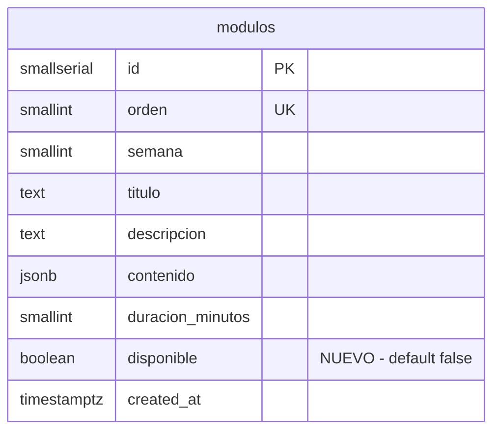
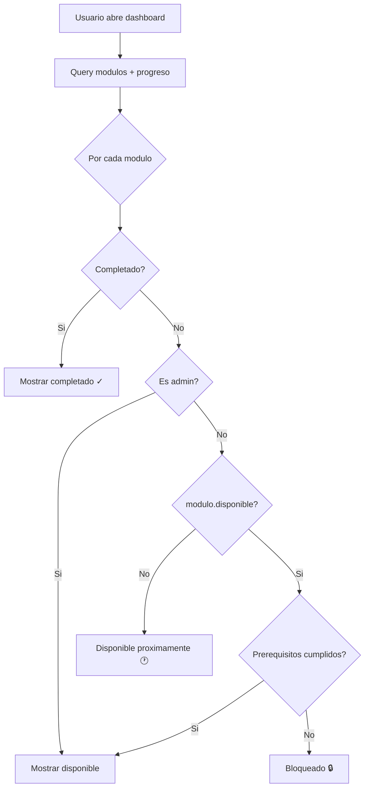

# feat: Bloqueo de control de modulos por disponibilidad

## Enhancement Summary

**Deepened on:** 2026-04-08
**Agentes de investigacion:** 8 (arquitectura, integridad de datos, seguridad, race conditions, patrones, spec flow, best practices, simplicidad)

### Hallazgos criticos descubiertos
1. `check_certificate_ready` cuenta TODAS las pruebas modulares -- bloquea certificacion si existen modulos no disponibles con pruebas
2. Calculos de progreso del dashboard (`totalModulos`, `allDone`) incluyen modulos no disponibles -- rompe CTA de diagnostico y certificado
3. `prueba.jsx` no tiene guard de acceso -- bypass directo a pruebas de modulos no disponibles
4. `submit-quiz` edge function no valida `disponible` -- unico punto con impacto real en integridad de datos
5. Double-click en toggle causa lecturas duplicadas por stale closure

### Decisiones de diseno
- **Estado visual `proximamente`**: se mantiene (requisito explicito del usuario), distinto de `bloqueado` por prerequisitos
- **Toggle inline**: excepcion consciente al patron form+save del admin, justificada por frecuencia de uso
- **RLS abierta**: confirmada por todos los agentes como correcta para este contexto
- **Sin Realtime**: evento demasiado infrecuente para justificar WebSocket permanente

---

## Overview

Permitir al admin habilitar/deshabilitar el acceso a modulos individuales desde el panel de administracion. Los modulos con `disponible = false` se muestran a los usuarios no-admin como "Disponible proximamente" y no pueden acceder a ellos. El taller tiene 4 semanas y se liberan modulos progresivamente.

**Patron validado:** Canvas LMS usa exactamente el mismo patron publish/unpublish para modulos.

## Problema actual

- No existe columna `disponible` en la tabla `modulos` (`supabase/migrations/001_schema.sql:8-17`)
- El acceso se controla solo por progresion secuencial en `getModuleStatus` (`src/course/dashboard.jsx:82-103`)
- El admin no tiene forma de controlar que modulos estan disponibles para los participantes
- Un usuario podria navegar directamente a `/course/modulo/:id` o `/course/modulo/:id/prueba` sin validacion
- `check_certificate_ready` y los calculos de progreso del dashboard asumen que todos los modulos en la BD estan activos

## Solucion propuesta

### 1. Migracion SQL: columna `disponible`

**Archivo nuevo:** `supabase/migrations/016_modulo_disponible.sql`

```sql
-- Agregar columna disponible a modulos (default false = bloqueado)
-- PG 11+ hace esto como metadata-only, sin rewrite de tabla
ALTER TABLE modulos ADD COLUMN disponible BOOLEAN NOT NULL DEFAULT false;

-- Habilitar modulos 1 y 2 (los dos primeros por orden)
UPDATE modulos SET disponible = true WHERE orden IN (1, 2);
```

Logica: `DEFAULT false` para que nuevos modulos requieran activacion manual. Los modulos 1 y 2 se configuran como disponibles de entrada.

#### Research Insights

- **PG 11+**: `ADD COLUMN ... NOT NULL DEFAULT <constante>` es instantaneo (metadata-only, sin rewrite). Supabase usa PG 15+.
- **No requiere indice**: con ~8 filas, seq scan es mas rapido que index scan.
- **Transaction**: Supabase ejecuta cada archivo de migracion en transaccion implicita. Si el UPDATE falla, el ALTER se revierte.
- **`WHERE orden IN (1, 2)` es aceptable**: la columna `orden` tiene constraint UNIQUE y el seed inserta valores deterministicos 1-6.

### 2. Migracion SQL: actualizar `check_certificate_ready`

**Archivo nuevo:** `supabase/migrations/017_certificate_filtrar_disponible.sql`

```sql
-- Actualizar check_certificate_ready para solo contar pruebas de modulos disponibles
-- Sin esto, modulos no disponibles con pruebas bloquean la certificacion de todos los usuarios

CREATE OR REPLACE FUNCTION public.check_certificate_ready(p_user_id UUID)
RETURNS JSONB
LANGUAGE plpgsql
SECURITY DEFINER
AS $$
DECLARE
  -- ... (misma estructura que la funcion actual en 006_security_fixes.sql)
  -- CAMBIO: filtrar por modulos.disponible = true en:
  -- 1. v_total_pruebas_modulares
  -- 2. promedio_modular
BEGIN
  -- Contar solo pruebas de modulos disponibles
  SELECT COUNT(*) INTO v_total_pruebas_modulares
  FROM public.pruebas p
  JOIN public.modulos m ON p.modulo_id = m.id
  WHERE p.tipo = 'modular' AND m.disponible = true;

  -- ... resto de la funcion, misma logica pero filtrando por disponible
END;
$$;
```

#### Por que es critico

Sin este cambio, si el admin crea un modulo 9 con prueba pero lo deja deshabilitado, `v_total_pruebas_modulares` sera 9 pero el usuario solo puede aprobar 8. **Nadie podra certificarse.**

### 3. Admin: toggle de disponibilidad

**Archivo:** `src/course/admin/admin-modulos.jsx`

**Nota de patron:** El admin usa formularios con guardado explicito (Editar -> Guardar). El toggle inline es una excepcion consciente, justificada porque habilitar/deshabilitar es una accion frecuente y atomica que no requiere un flujo de edicion.

**Handler con proteccion anti-double-click:**

```jsx
// Nuevo state para prevenir clicks concurrentes
const [toggling, setToggling] = useState(null)

// Nuevo handler (~linea 95)
const toggleDisponible = async (modulo) => {
  if (toggling) return
  setToggling(modulo.id)
  const nuevoValor = !modulo.disponible
  const { error } = await supabase.from('modulos')
    .update({ disponible: nuevoValor })
    .eq('id', modulo.id)
  if (error) {
    toast('Error actualizando disponibilidad', 'error')
    setToggling(null)
    return
  }
  // IMPORTANTE: usar callback form para evitar stale closure
  setModulos(prev => prev.map(m => m.id === modulo.id ? { ...m, disponible: nuevoValor } : m))
  toast('Modulo actualizado')
  setToggling(null)
}
```

**UI del toggle (linea ~204, zona de botones):**

```jsx
<button
  onClick={() => toggleDisponible(modulo)}
  disabled={toggling === modulo.id}
  className={`flex items-center gap-1 px-3 py-1.5 text-xs font-medium rounded-lg cursor-pointer ${
    modulo.disponible
      ? 'bg-emerald-50 text-emerald-600 hover:bg-emerald-100'
      : 'bg-slate-100 text-slate-400 hover:bg-slate-200'
  }`}
>
  {modulo.disponible ? <Eye className="w-3.5 h-3.5" /> : <EyeOff className="w-3.5 h-3.5" />}
  {modulo.disponible ? 'Visible' : 'Oculto'}
</button>
```

#### Research Insights

- **`setModulos(prev => ...)`** en lugar de `setModulos(modulos.map(...))` para evitar stale closures. Este bug existe en las demas funciones del archivo (`saveModulo`, `deleteModulo`, `createModulo`) pero su correccion esta fuera del scope de este PR.
- **Gate con `toggling`**: previene que double-click envie dos UPDATEs con el mismo valor.
- **Toast generico** `'Modulo actualizado'`: sigue el patron existente (mensajes cortos, sin tildes, generico por operacion).

### 4. Dashboard: estado "proximamente" + filtro de progreso

**Archivo:** `src/course/dashboard.jsx`

**Funcion `getModuleStatus` (lineas 82-103):**

```jsx
const getModuleStatus = (modulo, index) => {
  // ...calculo existente de allLessonsComplete, pruebaAprobada, retoEnviado...
  if (allLessonsComplete && retoEnviado && pruebaAprobada) return 'completado'
  if (isAdmin) return 'disponible'
  if (!modulo.disponible) return 'proximamente'  // NUEVO
  // ...resto de la logica secuencial existente...
}
```

**Calculos de progreso (CRITICO):**

```jsx
// Filtrar modulos disponibles para calculos de progreso
// Sin esto, modulos futuros en la BD rompen allDone y canDoDiagPost
const modulosActivos = modulos.filter(m => m.disponible || isAdmin)
const totalModulos = modulosActivos.length
const completedModulos = modulosActivos.filter((m, i) => getModuleStatus(m, modulos.indexOf(m)) === 'completado').length
```

**Renderizado de tarjeta (lineas 243-283):**

```jsx
// Linea ~246: deshabilitar tambien para proximamente
onClick={() => status !== 'bloqueado' && status !== 'proximamente' && navigate(`/course/modulo/${modulo.id}`)}
disabled={status === 'bloqueado' || status === 'proximamente'}

// Linea ~248-253: estilo visual para proximamente
className={`... ${
  status === 'completado' ? 'bg-white border-avianca-green/30 hover:shadow-md'
  : status === 'disponible' ? 'bg-white border-avianca-cyan/30 hover:shadow-md hover:border-avianca-cyan'
  : 'bg-slate-50 border-slate-200 opacity-60 cursor-not-allowed'  // bloqueado Y proximamente
}`}

// Linea ~281: icono y texto para proximamente
{status === 'proximamente' && (
  <span className="flex items-center gap-1 text-xs text-slate-400">
    <Clock className="w-3.5 h-3.5" /> Disponible proximamente
  </span>
)}
```

#### Research Insights

- **Orden de prioridad**: `completado > admin > proximamente > secuencial`. Un modulo completado mantiene su check verde aunque el admin lo desactive despues.
- **Progresion secuencial no se rompe**: si modulo 2 esta no-disponible, modulo 3 queda bloqueado porque la evaluacion del modulo anterior mira progreso, no disponibilidad. No se necesita logica extra para "saltar" modulos.
- **Dashboard sin re-fetch**: el dashboard recarga datos en cada mount. Si el admin cambia un toggle, el participante lo vera en su proxima navegacion. Suficiente para este contexto.

### 5. Guard en ruta de modulo

**Archivo:** `src/course/modulo.jsx`

Despues de cargar el modulo (lineas 37-42), verificar disponibilidad:

```jsx
// Agregar role a la desestructuracion de useAuth()
const { user, role } = useAuth()

// Despues de setModulo(moduloRes.data) ~linea 45
if (!moduloRes.data.disponible && role !== 'admin') {
  navigate('/course', { replace: true })
  toast('Este modulo aun no esta disponible', 'error')
  return
}
```

### 6. Guard en ruta de prueba

**Archivo:** `src/course/prueba.jsx`

**Hallazgo de arquitectura y seguridad:** sin este guard, un usuario puede navegar directamente a `/course/modulo/:id/prueba` y acceder a la prueba de un modulo no disponible.

```jsx
// Despues de cargar pruebaData, verificar disponibilidad del modulo padre
const { data: moduloData } = await supabase
  .from('modulos')
  .select('disponible')
  .eq('id', moduloId)
  .single()

if (moduloData && !moduloData.disponible && role !== 'admin') {
  navigate('/course', { replace: true })
  toast('Este modulo aun no esta disponible', 'error')
  return
}
```

### 7. Validacion en submit-quiz (edge function)

**Archivo:** `supabase/functions/submit-quiz/index.ts`

**Hallazgo de seguridad:** este es el unico endpoint donde un bypass tiene consecuencias reales (registra intentos y calificaciones en la BD).

```typescript
// Despues de obtener la prueba (~linea 48)
if (prueba.modulo_id) {
  const { data: modulo } = await supabaseAdmin
    .from('modulos')
    .select('disponible')
    .eq('id', prueba.modulo_id)
    .single()

  const isAdmin = user.app_metadata?.role === 'admin'
  if (modulo && !modulo.disponible && !isAdmin) {
    return new Response(
      JSON.stringify({ error: 'Este modulo aun no esta disponible' }),
      { status: 403, headers: corsHeaders }
    )
  }
}
```

## Diagrama de cambios





## Criterios de aceptacion

- [ ] Columna `disponible` existe en `modulos` con `DEFAULT false`
- [ ] Modulos 1 y 2 tienen `disponible = true` despues de la migracion
- [ ] Admin puede togglear disponibilidad desde el panel de modulos con un click
- [ ] Toggle protegido contra double-click (gate con `toggling` state)
- [ ] Usuarios no-admin ven "Disponible proximamente" en modulos con `disponible = false`
- [ ] Usuarios no-admin NO pueden navegar a `/course/modulo/:id` si `disponible = false`
- [ ] Usuarios no-admin NO pueden navegar a `/course/modulo/:id/prueba` si `disponible = false`
- [ ] `submit-quiz` rechaza envios a pruebas de modulos no disponibles (403)
- [ ] Admin puede acceder a cualquier modulo independientemente de `disponible`
- [ ] Modulos completados se muestran como completados sin importar `disponible`
- [ ] `check_certificate_ready` solo cuenta pruebas de modulos con `disponible = true`
- [ ] Calculos de progreso del dashboard (`totalModulos`, `allDone`) solo cuentan modulos disponibles
- [ ] El toggle es independiente de la logica de progresion secuencial existente

## Archivos a modificar

| Archivo | Cambio |
|---------|--------|
| `supabase/migrations/016_modulo_disponible.sql` | Nueva migracion: columna + datos iniciales |
| `supabase/migrations/017_certificate_filtrar_disponible.sql` | Actualizar `check_certificate_ready` para filtrar por `disponible` |
| `src/course/admin/admin-modulos.jsx` | Toggle de disponibilidad con proteccion anti-double-click |
| `src/course/dashboard.jsx` | Estado `proximamente` en `getModuleStatus` + filtro en calculos de progreso |
| `src/course/modulo.jsx` | Guard de acceso para no-admin |
| `src/course/prueba.jsx` | Guard de acceso para no-admin (modulo padre) |
| `supabase/functions/submit-quiz/index.ts` | Validar `disponible` antes de aceptar respuestas |

## Consideraciones

- **RLS**: La policy `authenticated_read_modulos` permite leer todos los modulos (`USING (true)`). Se mantiene asi porque el frontend necesita mostrar los modulos "proximamente". Confirmado por 8 agentes como correcto para este contexto.
- **Seguridad server-side**: El unico punto critico es `submit-quiz`, donde un bypass tiene impacto en integridad de datos. Los demas endpoints (lecciones, progreso) no contienen datos sensibles.
- **Certificado**: `check_certificate_ready` DEBE filtrarse por `disponible = true`. Sin esto, modulos futuros en la BD bloquean la certificacion.
- **Orden de prioridad en `getModuleStatus`**: `completado` > `admin` > `proximamente` > logica secuencial. Esto asegura que si un admin desactiva un modulo que alguien ya completo, no pierde su progreso visual.
- **Stale closures**: El handler `toggleDisponible` usa `setModulos(prev => ...)` en lugar de la closure vieja. Las demas funciones del admin tienen el mismo bug pero su correccion esta fuera del scope.
- **Sin Realtime**: evento demasiado infrecuente (~1 vez/semana) para justificar WebSocket. El dashboard recarga en cada mount.
- **Patron inline toggle**: excepcion al patron form+save existente, justificada por frecuencia y atomicidad de la operacion.

## Edge cases documentados

| Escenario | Comportamiento esperado |
|-----------|------------------------|
| Admin desactiva modulo completado por usuario | Sigue mostrando "completado" (progreso preservado) |
| Admin desactiva modulo en curso para un usuario | Muestra "proximamente", usuario no puede continuar hasta reactivacion |
| Admin reactiva modulo desactivado | Progreso parcial del usuario se preserva intacto |
| Todos los modulos deshabilitados | Dashboard muestra todas las tarjetas como "Disponible proximamente" |
| Nuevo modulo creado desde admin | Nace con `disponible = false` por default de la columna |
| Usuario en leccion cuando admin desactiva | Sesion activa no se interrumpe; al recargar/navegar se aplica guard |
| Admin crea modulo 9 con prueba pero no lo habilita | Certificado no se bloquea (check_certificate_ready filtra por disponible) |

## Sources

- Schema actual: `supabase/migrations/001_schema.sql:8-17`
- Dashboard status: `src/course/dashboard.jsx:82-103`
- Admin modulos: `src/course/admin/admin-modulos.jsx:84-96`
- RLS policies: `supabase/migrations/002_rls_policies.sql:20-21`
- Certificate function: `supabase/migrations/006_security_fixes.sql:102-196`
- Submit quiz: `supabase/functions/submit-quiz/index.ts`
- Protected routes: `src/components/protected-route.jsx`
- Admin write policies: `supabase/migrations/007_admin_write_policies.sql`
- Patron LMS validado: Canvas LMS (publish/unpublish)
- PG 11+ ADD COLUMN: [Cybertec](https://www.cybertec-postgresql.com/en/postgresql-alter-table-add-column-done-right/)
