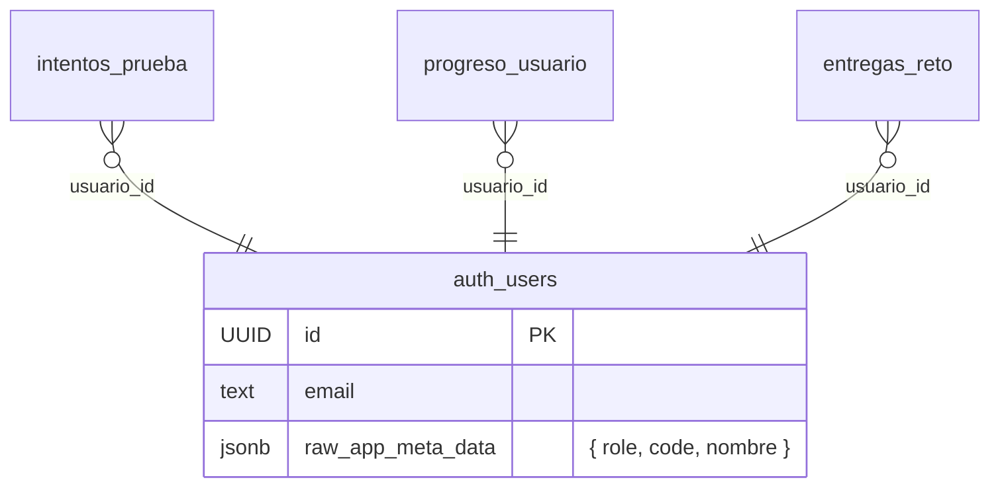

# Nombres de participantes en diploma + generación admin

## Overview

Hoy el diploma muestra el código `AVN-XXXX` como identificador del participante porque el modelo de datos no almacena nombres. Hay 117 nombres reales en `~/Descargas/Archivo Pao  - Hoja 1.csv` que mapean `código → nombre completo`. Se debe (1) cargar esos nombres en Supabase, (2) actualizar el generador de PDF para imprimir el nombre, y (3) permitir que el rol `admin` genere el diploma de cualquier participante desde el panel de administración.

## Problem Statement / Motivation

- El diploma actual (`src/course/certificado.jsx:85`) imprime `userCode` (ej: `AVN-7C2N`), no el nombre real del participante. Es un certificado pobre que el participante no puede mostrar como soporte formal.
- El modelo de datos (`auth.users` + tablas `progreso_*`) no tiene campo de nombre. El único anclaje es `app_metadata.code` (`AVN-XXXX`) y el email derivado.
- El admin solo puede ver progreso por código en `/course/admin`, pero no puede emitir diplomas de terceros (la RPC `check_certificate_ready` rechaza si `p_usuario_id != auth.uid()` — ver `supabase/migrations/017_certificate_filtrar_disponible.sql:22`).

## Proposed Solution

1. **Persistir nombre en `auth.users.app_metadata.nombre`** (mismo patrón que `code` y `role`, ver `supabase/generate-users.mjs:65`). No se crea tabla nueva: el dato es estático, 1:1 con el usuario, y el código ya consume `app_metadata` directamente desde `useAuth()`.
2. **Bulk import por script Node** (`supabase/import-participant-names.mjs`) que lee el CSV y llama `auth.admin.updateUserById(uid, { app_metadata: { ..., nombre } })` por cada fila, manteniendo `code` y `role` existentes.
3. **Refactor del PDF**: extraer la generación a `src/lib/certificate-pdf.js` para que tanto la vista del participante como el panel admin la reutilicen con `{ nombre, code, scores }`.
4. **Extender RPC `check_certificate_ready`** para permitir que un admin consulte cualquier `p_usuario_id` y para que devuelva `nombre` junto a `scores`.
5. **Botón "Generar diploma" por fila** en `/course/admin` que llama la RPC y dispara el PDF compartido — habilitado para todos los participantes (el admin decide si emitirlo aunque `ready=false`).

## Technical Considerations

- **Almacenamiento**: `app_metadata` solo es escribible con `service_role`, lo cual nos protege de que el participante edite su propio nombre desde el cliente. Se expone automáticamente en el JWT y queda accesible en `user.app_metadata.nombre` sin RPC adicional.
- **Idempotencia del bulk**: el script debe poder re-ejecutarse sin duplicar ni borrar datos. Hace `getUserByEmail({code}@copilot.internal)` (o `listUsers` paginado y match en memoria) y `updateUserById` con merge explícito de `app_metadata` (no spread destructivo).
- **Codes faltantes**: si un código del CSV no existe en Supabase o un usuario en Supabase no está en el CSV, se reporta en stdout pero no se rompe el bulk.
- **Normalización del nombre**: el CSV trae casing inconsistente (ej: `laura camila Florez Pantoja`). Aplicar `titleCase` simple (capitalizar inicial de cada palabra, respetar tildes) antes de guardar — el diploma luce mejor y el dato queda canónico.
- **Tildes**: el archivo `certificado.jsx` actual usa textos sin tilde por compatibilidad con `helvetica` de jsPDF (`Certificado de Completacion`). Los nombres pueden traer tildes. Verificar que jsPDF los renderice — si hay glitches, ajustar fuente (`helvetica` soporta latin1; nombres en español caben).
- **Layout del diploma**: el código cabe centrado a `fontSize 20`. Nombres como "Adriana Michel Vergara Velasquez" son largos. Reducir a `fontSize 16` con auto-shrink si `doc.getTextWidth(nombre) > maxWidth`, y dejar el código `AVN-XXXX` en una línea secundaria pequeña ("Código de participante: AVN-XXXX") para trazabilidad.
- **Admin bypass en RPC**: usar el patrón ya establecido en RLS `(select (auth.jwt()->'app_metadata'->>'role')) = 'admin'` (ver `supabase/migrations/007_admin_write_policies.sql:8`).
- **Diploma admin sin `ready`**: separar el dato (`ready`, `missing`, `scores`, `nombre`) del gating UI. La RPC sigue devolviendo `ready=false` con `missing[]` y los scores parciales; el admin renderiza el PDF de todos modos. El participante mantiene el gating actual.

## System-Wide Impact

- **Auth context** (`src/context/auth-context.jsx`): se agrega `userName` al provider. Cualquier vista futura que muestre saludo personalizado lo usa; no afecta vistas existentes salvo `certificado.jsx`.
- **Panel admin** (`src/course/admin.jsx`): la lista pasa a llamar una RPC que también devuelva `nombre` (extender `get_user_codes` o crear `admin_list_participants`). El renderizado de la tabla muestra nombre y código juntos.
- **RLS**: ningún cambio. La RPC `check_certificate_ready` es `SECURITY DEFINER` y la lógica de admin queda dentro de la función, no en políticas.
- **Bulk script**: convive con `generate-users.mjs` y `reset-and-generate-users.mjs`. No los reemplaza — solo enriquece nombres después de que los usuarios ya fueron creados.
- **Migración**: una sola migración SQL (`018_certificate_admin_y_nombre.sql`) que actualiza `check_certificate_ready` y opcionalmente `get_user_codes` (o agrega `admin_list_participants`).

## Acceptance Criteria

### Datos
- [x] `supabase/import-participant-names.mjs` lee `Archivo Pao  - Hoja 1.csv`, normaliza nombres (title-case, trim) y actualiza `app_metadata.nombre` en `auth.users` para los 117 participantes que matcheen por código
- [x] El script imprime resumen final: `X actualizados, Y no encontrados en DB, Z saltados por error`, sin abortar al primer fallo
- [x] El script preserva `app_metadata.role` y `app_metadata.code` (merge, no overwrite)
- [x] Re-ejecutar el script no genera cambios destructivos ni duplicados (idempotente)

### Diploma del participante (flujo existente)
- [x] Al descargar su propio diploma, el participante ve su nombre completo en el certificado en lugar del código
- [x] El código `AVN-XXXX` ya no se imprime en el PDF (decisión revisada: nombre solo)
- [x] Si un participante no tiene `nombre` cargado, el diploma usa el código como fallback (no rompe)
- [x] El nombre cabe sin desbordar el ancho útil del certificado (auto-shrink ≥ 14pt)
- [x] El filename del PDF pasa a `certificado-copilot-{slug-nombre}.pdf`

### Diploma admin
- [x] En `/course/admin`, cada fila con `ready=true` tiene un botón "Generar diploma" (icono `Award`) que descarga el PDF de ese participante usando su nombre (gating revisado: solo `ready=true`)
- [x] Un usuario sin rol admin que llame `check_certificate_ready` con un `p_usuario_id` ≠ `auth.uid()` recibe `No autorizado` (mantiene el guardrail actual)
- [x] La RPC devuelve `{ ready, missing, scores, nombre }` para admin y para el dueño

### UI admin secundaria
- [x] La tabla de participantes muestra nombre + código (nombre como columna principal, código como subtítulo monoespaciado)
- [x] El CSV de progreso incluye una columna `Nombre` adicional
- [x] El buscador filtra por código y por nombre

## Implementation Phases

### Fase 1 — Backend & Data

#### `supabase/migrations/018_certificate_admin_y_nombre.sql`
```sql
-- 1. check_certificate_ready: bypass admin + retornar nombre
CREATE OR REPLACE FUNCTION check_certificate_ready(p_usuario_id UUID)
RETURNS JSONB
LANGUAGE plpgsql
SECURITY DEFINER
SET search_path = ''
AS $$
DECLARE
  v_is_admin BOOLEAN;
  v_nombre TEXT;
  -- ... resto de variables existentes
BEGIN
  v_is_admin := (SELECT (auth.jwt()->'app_metadata'->>'role')) = 'admin';

  IF p_usuario_id != (SELECT auth.uid()) AND NOT v_is_admin THEN
    RAISE EXCEPTION 'No autorizado';
  END IF;

  SELECT u.raw_app_meta_data->>'nombre' INTO v_nombre
  FROM auth.users u WHERE u.id = p_usuario_id;

  -- ... lógica existente de missing/scores

  RETURN jsonb_build_object(
    'ready', array_length(v_missing, 1) IS NULL,
    'missing', to_jsonb(v_missing),
    'scores', v_scores,
    'nombre', v_nombre
  );
END;
$$;

-- 2. get_user_codes: incluir nombre
CREATE OR REPLACE FUNCTION get_user_codes(p_user_ids UUID[])
RETURNS TABLE (id UUID, code TEXT, nombre TEXT)
LANGUAGE sql
SECURITY DEFINER
SET search_path = ''
AS $$
  SELECT u.id,
         split_part(u.email, '@', 1) AS code,
         u.raw_app_meta_data->>'nombre' AS nombre
  FROM auth.users u
  WHERE u.id = ANY(p_user_ids);
$$;
```

#### `supabase/import-participant-names.mjs`
```javascript
// Pseudocódigo — estructura clave:
import { readFileSync } from 'fs'
import { createClient } from '@supabase/supabase-js'
import { config } from 'dotenv'
config()

const CSV_PATH = process.argv[2] // ruta al CSV
const supabase = createClient(process.env.VITE_SUPABASE_URL, process.env.SUPABASE_SERVICE_ROLE_KEY)

function titleCase(s) {
  return s.trim().toLowerCase().replace(/(^|\s)\S/g, t => t.toUpperCase())
}

async function main() {
  const rows = readFileSync(CSV_PATH, 'utf-8')
    .split('\n').slice(1)                         // saltar header
    .map(l => l.split(','))
    .filter(([code]) => code?.startsWith('AVN-'))

  // 1 sola página de listUsers (200) — basta para 117 participantes
  const { data: { users } } = await supabase.auth.admin.listUsers({ perPage: 1000 })
  const byEmail = new Map(users.map(u => [u.email, u]))

  let ok = 0, missing = 0, errors = 0
  for (const [code, _pass, nombreRaw] of rows) {
    const email = `${code.trim()}@copilot.internal`
    const u = byEmail.get(email)
    if (!u) { missing++; console.warn(`SKIP ${code}: no existe en DB`); continue }
    const nombre = titleCase(nombreRaw || '')
    const { error } = await supabase.auth.admin.updateUserById(u.id, {
      app_metadata: { ...u.app_metadata, nombre }
    })
    if (error) { errors++; console.error(`ERR ${code}: ${error.message}`); continue }
    ok++
  }
  console.log(`\n${ok} actualizados, ${missing} no encontrados, ${errors} errores`)
}
main().catch(console.error)
```

### Fase 2 — Refactor del PDF

#### `src/lib/certificate-pdf.js`
```javascript
// Función pura: recibe datos, genera y descarga el PDF
export async function generateCertificatePDF({ nombre, code, scores }) {
  const { jsPDF } = await import('jspdf')
  const doc = new jsPDF({ orientation: 'landscape', unit: 'mm', format: 'a4' })
  // ... layout actual de certificado.jsx:39-138
  // diferencias clave:
  //   - imprimir `nombre || code` con autoshrink
  //   - debajo: `Código: ${code}` en fontSize 9
  //   - filename: `certificado-copilot-${slug(nombre || code)}.pdf`
  doc.save(filename)
}

function slug(s) {
  return s.toLowerCase().normalize('NFD').replace(/[̀-ͯ]/g, '')
          .replace(/[^a-z0-9]+/g, '-').replace(/^-|-$/g, '')
}
```

#### `src/course/certificado.jsx`
- Borrar el cuerpo de `generatePDF` (líneas 33-144) y delegar a `generateCertificatePDF({ nombre, code, scores })`
- Usar `data.nombre` (de la RPC) como fuente del nombre, con fallback a `userCode`

#### `src/context/auth-context.jsx`
- Agregar `userName = user?.app_metadata?.nombre ?? null` al provider y exportarlo

### Fase 3 — UI Admin

#### `src/course/admin.jsx`
- En `loadAdmin` (línea ~131), `userCodes` ya devuelve `{ id, code, nombre }`. Mapear `nombre` al `userMap`
- Añadir columna "Participante" (nombre arriba, código abajo en `font-mono text-xs`)
- En la fila, junto al botón de reset, agregar:
  ```jsx
  <button
    onClick={() => generateAdminDiploma(u.id)}
    className="..."
    title="Generar diploma"
  >
    <Award className="w-3.5 h-3.5" />
  </button>
  ```
- `generateAdminDiploma(userId)`:
  ```javascript
  const { data, error } = await supabase.rpc('check_certificate_ready', { p_usuario_id: userId })
  if (error) { toast(`Error: ${error.message}`, 'error'); return }
  await generateCertificatePDF({
    nombre: data.nombre,
    code: usuarios.find(x => x.id === userId).code,
    scores: data.scores,
  })
  ```
- Extender `downloadCSV` (línea 209) con header `Nombre` y columna correspondiente
- Extender el `search` para matchear `code` o `nombre`

## ERD



No hay tablas nuevas. El único cambio "estructural" vive dentro de `raw_app_meta_data` que ya es JSONB.

## Dependencies & Risks

| Riesgo | Mitigación |
|---|---|
| Alguien edita el CSV con tildes y jsPDF las renderiza mal | Probar con un nombre con tilde antes de hacer rollout. Si falla, swap a fuente Unicode (`addFont`) o normalizar tildes con `NFD + replace` solo para el render (preservando el nombre original en DB) |
| El bulk corre dos veces y rompe `app_metadata` | El script merge `...u.app_metadata` antes de inyectar `nombre`. Idempotente |
| Admin emite diploma para usuario incompleto y aparece `0%` en columnas | Decisión explícita del producto. Si molesta, condicionar habilitación del botón a `data.ready === true` (cambio de una línea) |
| `raw_app_meta_data` no es accesible vía SELECT directo desde `anon` | La RPC es `SECURITY DEFINER`, lo expone controladamente. Coherente con `get_user_codes` actual |
| `MEMORY.md` global prohíbe UPDATE/DELETE de datos productivos (módulos, pruebas, preguntas, lecciones) | El bulk solo escribe sobre `auth.users.app_metadata.nombre`, campo que hoy está vacío. No toca tablas de contenido. Confirmar con el usuario antes de correr en producción |
| El CSV tiene formato `Usuario,Contraseña,Estatus` y "Estatus" en realidad es el nombre — un futuro lector puede confundirse | El plan documenta esto; el script comenta explícitamente la columna 3 |

## Test Plan

- **Unit**: probar `titleCase` y `slug` con casos: tildes, doble espacio, casing mixto, ñ
- **Integración local**:
  - Correr `node supabase/import-participant-names.mjs ~/Descargas/Archivo\ Pao\ \ -\ Hoja\ 1.csv` contra Supabase local
  - Loguearse como AVN-7C2N (Paola), descargar diploma → verificar nombre "Paola Andrea Rodriguez Rodriguez" en el PDF
  - Loguearse como admin, abrir `/course/admin`, descargar diploma de Paola → mismo PDF
  - Loguearse como participante normal e invocar la RPC con `p_usuario_id` ajeno → recibir `No autorizado`
- **Edge**:
  - Usuario sin nombre cargado: descargar como participante → ver `AVN-XXXX` como fallback en el diploma
  - Admin descarga para usuario `sin_iniciar`: ver scores en 0/`—` pero PDF sigue generándose
  - Re-ejecutar el bulk: confirmar `0 errores, 117 actualizados` (todos ya existen)

## Sources & References

### Internas
- `src/course/certificado.jsx:33-144` — generación PDF actual (refactorizar)
- `src/course/admin.jsx:131-134` — uso de `get_user_codes` y mapping
- `src/course/admin.jsx:209-234` — `downloadCSV` (extender con `Nombre`)
- `src/context/auth-context.jsx:34` — patrón `userCode = user?.app_metadata?.code`
- `supabase/generate-users.mjs:65` — patrón `app_metadata: { role, code }` (extender con `nombre` en futuras generaciones si se quiere)
- `supabase/migrations/010_get_user_codes.sql` — RPC a extender con `nombre`
- `supabase/migrations/017_certificate_filtrar_disponible.sql:22` — guard `auth.uid()` a flexibilizar para admin
- `supabase/migrations/007_admin_write_policies.sql:8` — patrón `(auth.jwt()->'app_metadata'->>'role') = 'admin'`

### Datos fuente
- `~/Descargas/Archivo Pao  - Hoja 1.csv` — 117 filas `Usuario,Contraseña,Estatus` donde `Estatus` = nombre completo

### Externas
- jsPDF font support — verificar latin1 / Unicode antes de pelear con tildes (https://artskydj.github.io/jsPDF/docs/jsPDF.html)
- Supabase Auth Admin API — `updateUserById` con `app_metadata` merge (https://supabase.com/docs/reference/javascript/auth-admin-updateuserbyid)
